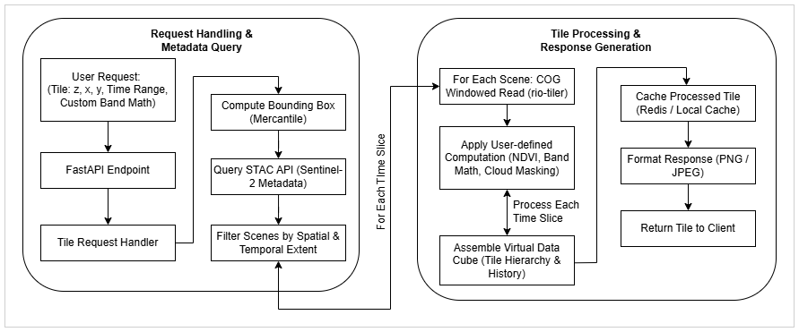

# Summary

**VirtuGhan** is a Python-based geospatial data pipeline designed for on-the-fly computation on raster tiles, enabling real-time processing of Earth Observation (EO) data. By leveraging Cloud-Optimized GeoTIFFs (COGs) and SpatioTemporal Asset Catalog (STAC) endpoints, it efficiently processes data at multiple zoom levels and time dimensions without requiring full-scene precomputations.
Unlike traditional processing pipelines that rely on pre-aggregated layers, VirtuGhan retrieves and processes only the necessary tiles on demand, significantly reducing storage needs and computational overhead. This efficient approach minimizes data transfer and optimizes infrastructure utilization, making it a cost-effective solution for cloud-based EO analytics [@rio-tiler; @mercantile; @sentinel2cogs]. The framework supports user-defined band mathematics, multi-temporal analysis, and partial reads from Sentinel-2 data, with an integrated caching mechanism for optimizing repeated queries [@fastapi].
As an open-source and scalable platform, VirtuGhan provides a lightweight alternative to traditional data cube architectures. Its optimized tile-based computation allows it to run efficiently even on minimal hardware, making large-scale satellite imagery processing more accessible for researchers, analysts, and developers.

# Statement of Need

Big Earth Data, with its high-resolution, multi-temporal satellite imagery, poses growing challenges for storage and real-time processing, often exceeding traditional workflows' capacities (Sudmanns et al., 2019). As EO data volumes expand, efficient management strategies are needed to address rising computational and storage demands. Data cubes have emerged as a structured approach to managing large-scale EO datasets, facilitating efficient data access and analysis through precomputed storage architectures (Giuliani & Camara, 2019). However, data cubes often store pre-aggregated or processed data layers, which can lead to increased storage requirements and may not support real-time data updates effectively. This approach can result in inefficiencies, as the storage of multiple processed layers extends the storage burden. Additionally, pre-computation is done on entire images rather than individual tiles, storing pre-aggregated layers for later analysis (Sudmanns et al., 2019). This approach improves query efficiency but also increases memory usage and computational load, potentially allocating resources to areas that may not always be relevant. While cloud-based EO platforms like Google Earth Engine offer scalable solutions, they require significant infrastructure, limiting accessibility.

VirtuGhan was designed to overcome these challenges by providing a scalable and efficient solution. It optimizes data processing by retrieving and computing only the necessary image tiles on demand, minimizing storage needs and computational overhead. This enables efficient, real-time analysis at multiple zoom levels while eliminating the need for large-scale precomputed datasets. By prioritizing computation over storage, VirtuGhan provides a lightweight, scalable, and cost-effective alternative to traditional EO data cubes and cloud-based processing platforms.

## Implementation

### Tile Requests and Partial Reads

A user or front-end requests map tiles via `(z, x, y)` coordinates (along with an optional date/time range and custom band math). Using [mercantile’s approach][@mercantile], VirtuGhan determines the tile’s bounding box. It then queries Sentinel-2 STAC metadata to identify scenes covering that region. Via the Cloud-Optimized GeoTIFF specification [@sentinel2cogs], windowed reads fetch only the portion of the image corresponding to the requested tile [@rio-tiler]. 

### On-the-Fly Computation

Once partial reads are loaded, VirtuGhan applies user-defined formulas or filters (e.g., NDVI, cloud masking) per pixel. Because all computations occur at tile-creation time, the framework can flexibly incorporate new formulas or data corrections without reprocessing entire scenes.

### Caching and Scaling

The processed tiles (e.g., PNG or JPEG) can be cached. If an identical tile request recurs, VirtuGhan serves it directly from the cache—improving performance and lowering bandwidth usage. As zoom levels shift, the system adjusts how the partial reads are resampled, ensuring minimal repeated data access. 

# Figures

## Future Directions

- **Mosaicking**: Automating multi-scene merges for larger coverage areas.  
- **Additional Sensors**: Adding Landsat, MODIS, and commercial satellite data.  
- **Plugins and ML Integration**: Allowing advanced user-defined band math or machine-learning inference models for on-the-fly classification.  
- **Distributed Caching**: Supporting scalable deployments for high-traffic or cluster-based environments.

# Application Areas
VirtuGhan enables real-time geospatial data processing for various Earth observation applications. It helps monitor environmental changes like deforestation, glacial lake expansion, urban heat islands, and wildfires without requiring extensive data storage. In disaster response, it provides rapid analysis of floods, landslides, cyclones, and earthquakes. Urban planners can analyze land use, infrastructure growth, and air quality. AI integration on VirtuGhan obtained datasets can support automated land classification, object detection, and biodiversity tracking. It also aids security efforts, including border monitoring and conflict damage assessment. As an open-source platform, VirtuGhan enhances accessibility for citizen science, environmental advocacy, and academic research. By prioritizing computation over storage, it offers a cost-effective and scalable alternative to traditional geospatial tools.

# Acknowledgments

We extend our gratitude to the maintainers of foundational GIS libraries such as Rasterio [@rasterio], rio-tiler [@rio-tiler], Mercantile [@mercantile], and FastAPI [@fastapi]. We also thank colleagues and mentors at Paris Lodron University of Salzburg and in the Copernicus Masters in Digital Earth program for their insights and support.

# References
