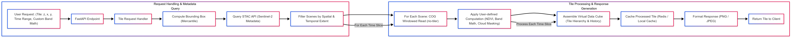

# Summary

We introduce **VirtuGhan**, a Python-based geospatial data pipeline designed for on-the-fly computations on raster tiles. By leveraging Cloud-Optimized GeoTIFFs (COGs) and SpatioTemporal Asset Catalog (STAC) endpoints [@stacspec], VirtuGhan enables real-time data processing at multiple zoom levels and time dimensions. VirtuGhan focses on on-demand tile computation, computes results on demand, minimizing data transfers and infrastructure overhead [@rio-tiler; @mercantile] for entire scene. This approach is cost-effective because only the necessary tiles (i.e., bounding boxes of interest) are read & computation is applied on tiles when fetching from source imagery [@sentinel2cogs]. The framework supports user-defined band math, multi-temporal analyses, partial reads from Cloud Optimized Sentinel-2 data, and a caching mechanism for repeat requests [@fastapi]. Ultimately, **VirtuGhan** provides a scalable, open-source platform for modern geospatial data analytics, running efficiently even on minimal hardware.

# Statement of Need

Large-scale Earth Observation (EO) analytics often demand substantial storage and processing power, especially when frequently querying large satellite datasets at varied resolutions. Traditional pipelines that store entire scenes or “data cubes” comes with disadvantage of  cost it takes to maintain. **VirtuGhan** addresses this gap by:

- Retrieving and processing only the tiles required, reducing bandwidth, storage, and memory usage.
- Applying the computation while fetching the tile for a same area of interest in multiple hierarchy of tiles
- Providing a virtual “data cube” model in which pixel transformations are computed on-the-fly, negating the need to store massive multi-band, multi-temporal archives.  
- Facilitating google earth engine alike computation, interactive geospatial exploration for scientists, engineers, and data analysts who need to quickly visualize or process recent satellite data without incurring large cloud-computing costs in different zoom levels of same area.

## Implementation

### Tile Requests and Partial Reads

A user or front-end requests map tiles via `(z, x, y)` coordinates (along with an optional date/time range and custom band math). Using [mercantile’s approach][@mercantile], VirtuGhan determines the tile’s bounding box. It then queries Sentinel-2 STAC metadata to identify scenes covering that region. Via the Cloud-Optimized GeoTIFF specification [@sentinel2cogs], windowed reads fetch only the portion of the image corresponding to the requested tile [@rio-tiler]. 

### On-the-Fly Computation

Once partial reads are loaded, VirtuGhan applies user-defined formulas or filters (e.g., NDVI, cloud masking) per pixel. Because all computations occur at tile-creation time, the framework can flexibly incorporate new formulas or data corrections without reprocessing entire scenes.

### Caching and Scaling

The processed tiles (e.g., PNG or JPEG) can be cached. If an identical tile request recurs, VirtuGhan serves it directly from the cache—improving performance and lowering bandwidth usage. As zoom levels shift, the system adjusts how the partial reads are resampled, ensuring minimal repeated data access. 

# Figures

## Future Directions

- **Mosaicking**: Automating multi-scene merges for larger coverage areas.  
- **Additional Sensors**: Adding Landsat, MODIS, and commercial satellite data.  
- **Plugins and ML Integration**: Allowing advanced user-defined band math or machine-learning inference models for on-the-fly classification.  
- **Distributed Caching**: Supporting scalable deployments for high-traffic or cluster-based environments.

# Application Areas
VirtuGhan enables real-time geospatial data processing for various Earth observation applications. It helps monitor environmental changes like deforestation, glacial lake expansion, urban heat islands, and wildfires without requiring extensive data storage. In disaster response, it provides rapid analysis of floods, landslides, cyclones, and earthquakes. Urban planners can analyze land use, infrastructure growth, and air quality. AI integration on VirtuGhan obtained datasets can support automated land classification, object detection, and biodiversity tracking. It also aids security efforts, including border monitoring and conflict damage assessment. As an open-source platform, VirtuGhan enhances accessibility for citizen science, environmental advocacy, and academic research. By prioritizing computation over storage, it offers a cost-effective and scalable alternative to traditional geospatial tools.

# Acknowledgments

We extend our gratitude to the maintainers of foundational GIS libraries such as Rasterio [@rasterio], rio-tiler [@rio-tiler], Mercantile [@mercantile], and FastAPI [@fastapi]. We also thank colleagues and mentors at Paris Lodron University of Salzburg and in the Copernicus Masters in Digital Earth program for their insights and support.

# References
